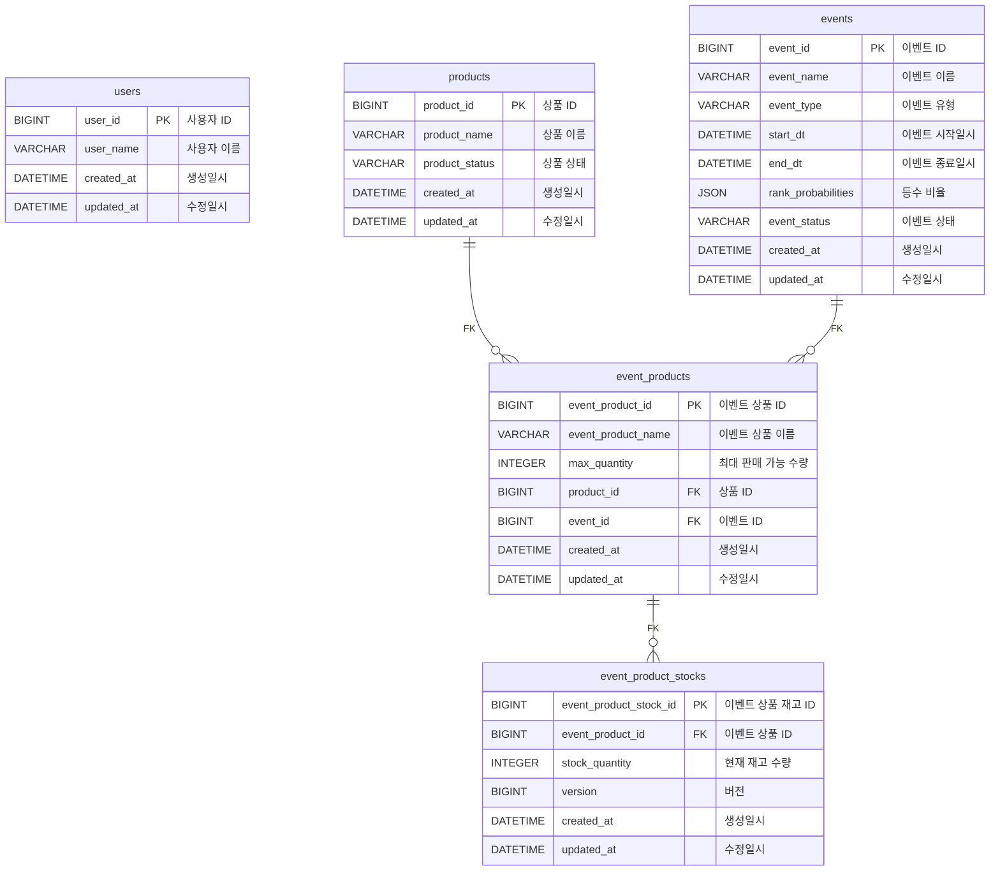

# lucky-draw-event

## Background

- 사용자는 랜덤 추첨을 통해 당첨 여부를 확인할 수 있다.
- 추첨 결과는 등수별 당첨 확률에 의해 결정되며, 당첨 확률에 따라 당첨 등수가 결정된다.
- 일정 기간동안 단 한 번만 추첨할 수 있다.

## Issues

- 최대 수량이 제한되어 있기 때문에 재고 관리가 필요하다.
- 추첨 결과는 등수별 당첨 확률에 의해 결정되기 때문에 확률을 관리할 수 있는 방법이 필요하다.
  - 만약, 1등의 최대 수량만큼 추첨이 되었을 때 동적으로 정책 변경이 가능하도록 설계해야 한다.
    - 예를 들어, 1등의 최대 수량이 10개로 설정되어 있고, 10개가 모두 추첨되었을 때 1등의 당첨 확률을 0으로 변경한다.
    - 방안: 하향 조정 정책 / 선택권 부여 방식 -> 하향 조정이 시스템으로 만들 수 있어서 더 쉬울 것 같음

## ERD

